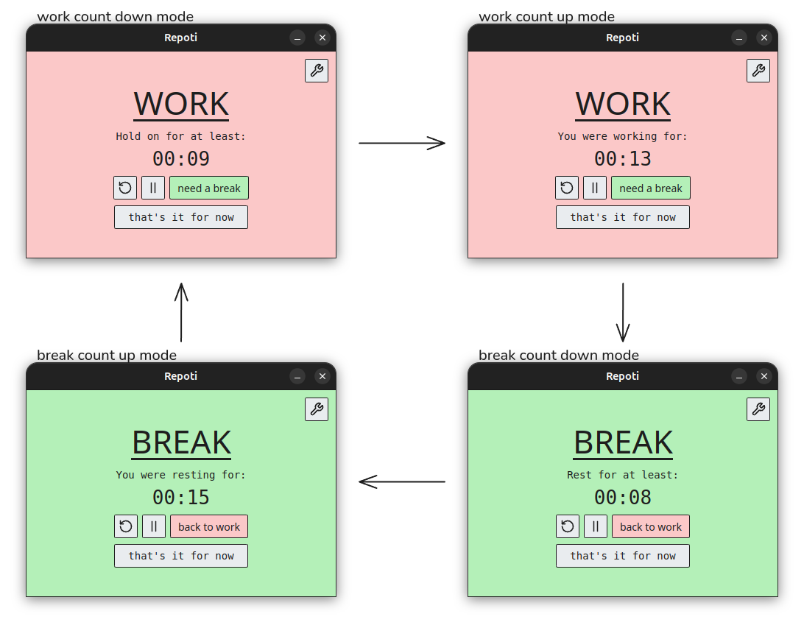

# REPOTI — REverse POmodoro TImer

Pomodoro timer that treats set durations as a **minimums** rather than **boundaries**.

Premise is simple: sometimes you feel like 5 minutes of work is the best you can do.
With this simple app you can set work interval for 5 minutes and then let the
[Ovsikana Effect](https://en.wikipedia.org/wiki/Ovsiankina_effect) (need to finish started task) to take the wheel.
The app will not commend you to take a break, it will merely suggest it briefly via *ping* and then it will start counting up.
When you feel that enough is enough you hit the break and the same logic applies 
there: don't come back to work until you spent at least X minutes not thinking,
if you need more then sit back and relax.

**Disclaimer: It might not work for everyone, but I have a chronic problem of resting for too short and cooking myself later on with work**

The additional bonus is that all your sessions (breaks and work) are saved into the .csv file
that you can then analyze for patterns.

*(Default path for this file is in `~/.local/share/repoti/sessions.csv` but you can change it)*




## Build (Ubuntu 24.04LTS / Ubuntu 26.04LTS tested)

```sh
sudo apt update
sudo apt install build-essential curl libwebkit2gtk-4.1-dev libssl-dev librsvg2-dev libxdo-dev
curl https://sh.rustup.rs -sSf | sh   # Rust toolchain
npm install
npm run tauri build -- --bundles deb
```

For development with hot reload: `npm run tauri dev`

## Install

```sh
sudo apt install ./src-tauri/target/release/bundle/deb/Repoti_0.1.0_amd64.deb
```

Then launch **Repoti** from the app menu. Uninstall with `sudo apt remove repoti`.

## Acknowledgement
1. The design and idea was my own, but I did not know if that idea will work so I decided to vibe-code it with Opus 5.5 (forgive me lord for I have sinned)
2. Idea for the technological stack came from a very cool app [Pomotroid](https://github.com/splode/pomotroid)
3. I keep it Apache 2.0 so anyone can do something with it and if it helps just one more person, I will be happy
